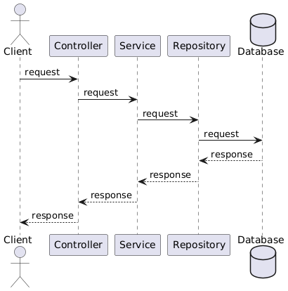
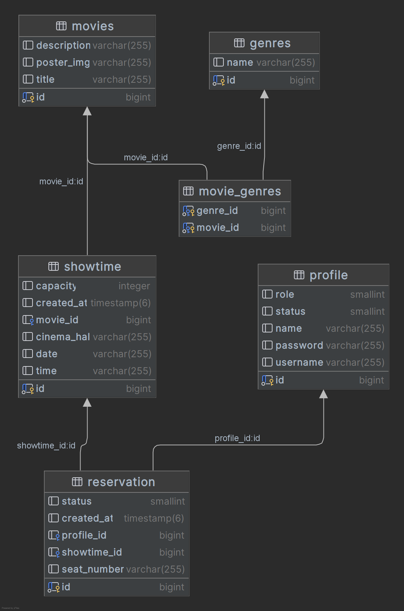

# Movie Reservation System API

This is the Movie Reservation System API that allows users to book movie tickets. It provides endpoints for managing
movies, profiles, reservations, and showtime.

## Base URL

http://localhost:8080/api/v1/

## API Documentation

The API uses Swagger for documentation and can be accessed at:
http://localhost:8080/swagger-ui/index.html

## Sequence diagram


## Class diagram


### Relationships
- **movies** to **movie_genres**: Many-to-many relationship (one movie can have multiple genres, and one genre can be associated with multiple movies).
- **movies** to **showtime**: One-to-many relationship (one movie can have multiple showtimes).
- **profile** to **reservation**: One-to-many relationship (one profile can have multiple reservations).
- **showtime** to **reservation**: One-to-many relationship (one showtime can have multiple reservations).

# Security
- The API is secured using JSON Web Tokens (JWT) handled by Auth0. To access the API, you will need to obtain a JWT by authenticating with the /login endpoint. The JWT should then be passed in the Authorize option available in the Swagger-ui.


## How to Run

1. Make sure you have **Java** and **Maven** installed.
2. Clone the repository:
   ```bash
   git clone https://github.com/your-username/movie_reservation_system.git
3. Navigate to the project directory:

   ```bash
   cd movie_reservation_system

4. Build the project using Maven:
   ```bash
   mvn clean install

5. Run the application:
   ```bash
   mvn spring-boot:run

## Technologies Used
- Java 17
- Spring Boot
- PostgreSQL
- Spring Data JPA
- Spring Security
- JSON Web Tokens (JWT)
- Jakarta Validation API
- Swagger API Documentation

Notes
All operations on movies, showtimes, and profiles that modify data (POST, PUT, DELETE) are restricted to admins only.
Authentication is required to access the API endpoints. Use the /api/v1/authorization endpoint to obtain a token.